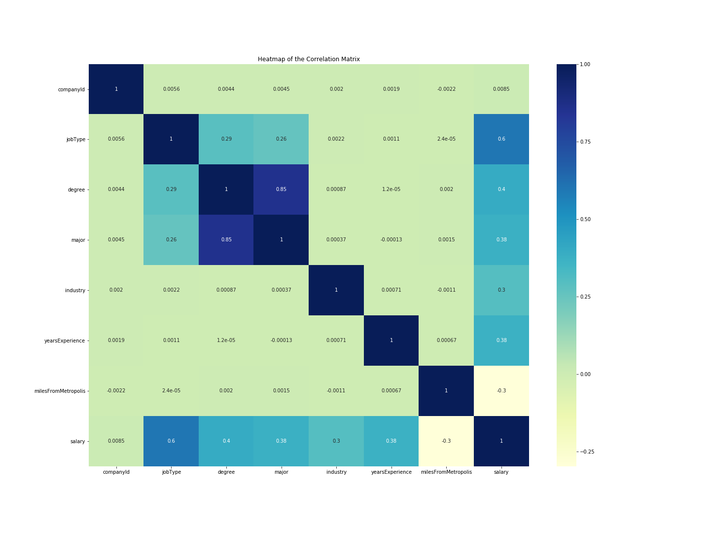
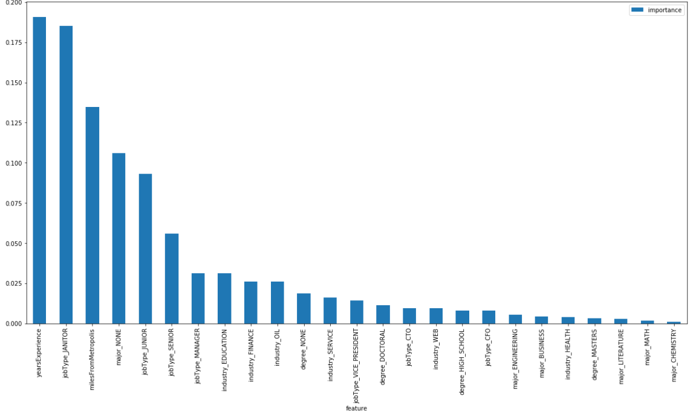

# Salary-prediction
This repo includes a jupyter notebook that goes through different steps of a project for predicting salary based on some job features.
The notebook includes three steps, defining the problem, discovering the data, and developing solution. The whole process is explained step by step in the notebook using markdowns.
## Defining problem
The problem to be solved in this project was predicting salary for upcoming jobs based on features of them. 
## Discovery
In the first step I started with loading and inspecting data, cleaning data, EDA, and establishing a baseline.
EDA or exploratory data analysis included summarizing variables, looking for correlations between features and the target variable and among features, and inspecting  outliers. It turned out that there is no abnormal outlier in our data set.
Studying the correlation between features and target suggested that job type has the strongest correlation with salary as shown below. 
### Establishing a baseline
So I decided to use average of salary for subcategories of job type to establish a baseline for models of prediction. The accuracy of this prediction method was 963.92 using mse as metric. My aim in developing solution was to reduce this number as much as I could while avoiding over fitting in my modeling.
## Developing solution
At first step towards developing solution, I prepared data for modeling by one-hot-encoding categorical variables. The next step was selecting and tuning algorithms to predict salary in such a way that reduces the risk of over fitting and under fitting. I chose Linear Regression (ln), Random Forest Regressor (rfr), and Gradient Boosting Regressor (gbr) as predictors. I have also attempted standard scaling data for lr, but since it did not make a big different, I just dropped it from the final version. 
In tuning rfr and gbr algorithms, I attempted to avoid over fitting by moderate max_features. Some say that the depth of trees also contributes to over fitting, but no such thing is indicated in sklearn official doc. I have got a moderately good result with 75 estimators in rfr that did not change much by increasing estimators to even 150. Although gbr provided us with better results, feature importances reported by rfr looks better distributed. Here is rfr feature importance: And here is gbr feature importance:  Moreover, rfr is processed way quicker than gbr. Therefore I suggested that rfr could also be a reasonable choice due to better distribution of parameters and faster processing. 
## How to improve this modeling
I am not supper happy with the feature importance result, it could be distributed more evenly. However I couldn't find a way to do so. It remains in my to-do-list.
